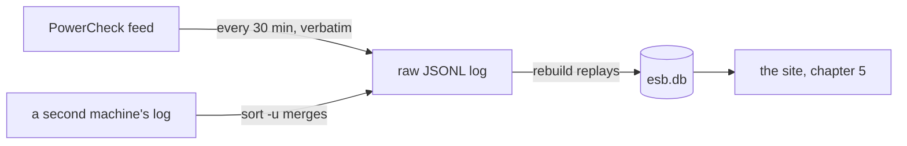

# 1. Write it down before you read it
*~7 min read · pre-PR commits · 31 July 2026*

*Where we are:* the very beginning. A public feed of live power outages that forgets each one
within hours, a question that will not be answerable for months, and one design decision to
make before the first byte arrives.

## The question that opened this stretch

The water site taught me an expensive lesson about archives. Its database is built by parsing
the feed and *upserting* rows — insert the new, update the changed — which means the archive
and the interpretation are the same object. When a parsing decision turns out wrong in month
three, the original bytes are gone; the water site's own rules say it plainly: anything that
rewrites data is a rebuild, and a rebuild costs the accumulated archive. Its one append-only
file — the log of model-read end times — became the most defensible artefact in that
repository precisely because it was never edited.

This project got to start from that lesson instead of arriving at it. The question for day
one was not "what should the database look like?" but "what must be true so that every future
mistake is recoverable?" And the answer was written into the first real commit: **the raw
logs are the source of truth, and the database is disposable** (commit "Add ESB Networks
outage collector", 31 Jul 2026).

## What changed

### Log first, parse second

On every pass — hourly in the first days, every 30 minutes since (chapter 2) — the collector
fetches ESB's outage list, and the first thing it does with
the response — before any parsing, any validation, anything — is append it, verbatim, to a
log file. Then it fetches the detail of each outage that is new or still changing, and each
of those responses is appended too, verbatim, before it is read. Only then does anything
interpret the bytes and fold them into a SQLite database.

```
data/
  raw/
    runs-2026-07.jsonl          # one line per run, with the list response verbatim
    observations-2026-07.jsonl  # one line per detail fetch, body verbatim
  esb.db                        # derived SQLite index
```

> **Concept: a source of truth and a derived index.** Two kinds of stored data have opposite
> rules. A *source of truth* is what actually happened — here, the exact bytes ESB served at
> a known moment. It is only ever appended to, never edited, because an edit destroys the one
> thing it is for. A *derived index* is a convenient arrangement of the truth — here, a
> database with one row per outage and one row per observed change — and its rule is the
> mirror image: it may be deleted at any time, because a `rebuild` command replays every
> logged response through the same code a live run uses and produces it again. The payoff is
> that a parsing bug found in month six is not a scar in the archive; it is a bug fix and a
> rebuild. The water site's database is its archive, so a wrong interpretation there is
> forever. Here the interpretation is always provisional and the bytes are forever. A
> round-trip test holds the promise in place: rebuild the database from the logs and it must
> reproduce the live one exactly.

The database the replay produces has three tables: `outage`, one row per record, with every
timestamp stored twice — `*_raw` exactly as ESB sent it and `*_utc` normalised;
`outage_change`, every field-level change ever observed, which is where an incident's story
lives (how the restoration estimate moved, not just where it landed); and `run`, one row per
collection pass. The double-stored timestamps are the invariant in miniature: the normalised
value is an interpretation, so the raw string stays beside it.



### Why the archive lives in bytes here and in rows there

This is the first real fork from the water site, and it is worth being precise about, because
the two designs are both right *for their feeds*. Uisce Éireann's notices stay published for
days or weeks, so a twice-daily build that parses and upserts loses very little: the feed
itself is a slow-moving record, and the database accumulates it comfortably. ESB purges an
outage a few hours after restoration — retention as short as 112 minutes has been observed
(README) — and wipes the status message at the moment of restoration, so whatever a pass
fails to capture is gone permanently. A feed that volatile turns every collection pass into
an unrepeatable observation, and unrepeatable observations are exactly what you record raw.
The water site archives a *ledger*; this site archives *sightings*.

### Surviving your own hardware

A design that says "the log is everything" had better protect the log, and the log lives on a
Raspberry Pi's SD card — a single point of failure for a dataset that cannot be re-collected.
Two commits in the first two days dealt with the ways a small computer in a hall can hurt an
append-only file (both: "Add unattended git backup and survive damaged log lines",
1 Aug 2026).

First, damage. A power cut mid-append truncates a line; a backup that reads the file
mid-write captures half a record. So the replay skips lines that will not parse instead of
raising — one damaged line must not make the entire history unreadable — and every skip is
counted and reported by `rebuild` rather than passing silently. Second, loss. The raw logs
push to a git remote on a timer, and a failed push raises an alert, because a backup that
stopped silently is precisely the failure being defended against. The database is excluded
from the backup: a binary rewritten every run cannot be delta-compressed, and it rebuilds
from the logs anyway.

> **Concept: an idempotent merge.** Suppose the Pi dies during a storm — the most interesting
> possible time — and a laptop stands in for a day. Now two machines hold overlapping logs.
> The collector's answer is a property, not a procedure: every log line is written with its
> JSON keys in sorted order, so the same record serialises to the same bytes on any machine.
> That means duplicate records are *byte-identical* lines, and the Unix command `sort -u`
> — sort the lines, keep the unique ones — merges any two logs perfectly: overlaps collapse,
> nothing is lost, and running the merge twice changes nothing. Run identifiers carry a
> random component so two machines cannot collide, and the replay orders runs by their start
> time, so the interleaved history reconstructs correctly. One line of code
> (`sort_keys=True`) is load-bearing for the whole recovery story, and the repo's
> instructions say so, so nobody "tidies" it away.

Standby collection needs no special support because of this: the collector is standard
library only, so any machine with Python and a checkout can collect into a spare directory —
a laptop on a phone hotspot transfers roughly 12 KB per run — and the pile of logs merges in
afterwards. Any pile of raw logs, from any number of machines, rebuilds into one complete
database.

### Worked example: the timestamp that proved the timezone

The feed's timestamps are the first place "keep the raw bytes" paid for itself. ESB reports
times in the detail body as `dd/mm/yyyy HH:MM` with no timezone marker. Dublin time or UTC?
In summer they differ by an hour, and every duration on the future site depends on the
answer. The proof came from a live outage, id 2826455: it reported a restore time of
**17:34** while the collecting machine's clock read **17:26 UTC** (README, "Timestamps").
Read as UTC, that restoration would be eight minutes in the future — for an outage already
marked restored. Read as Irish local time (16:34 UTC), it is 52 minutes in the past, which is
what a restored outage looks like. So the body's timestamps are Europe/Dublin local time, and
the collector converts them to UTC on the way into the database.

The conversion has a trap the water site never had to face at this level: twice a year the
local clock jumps. On the October fall-back the hour from 01:00 to 02:00 happens twice, so
`26/10/2026 01:30` names two different moments; on the March spring-forward an hour never
happens at all. Times falling in a transition are flagged `tz_ambiguous = 1` rather than
silently trusted — and because the raw string is always kept, a flagged row can be revisited
with better information later. The operational docs even say what to check after each
transition: a count of *zero* ambiguous times across an October change-over would mean the
flagging is broken, not that the problem kindly failed to occur.

## Where it left the site

There was no site. There was a collector that had made its first pass at 21:02 on 31 July
2026, a log with a handful of runs in it, a database that could be deleted without loss, and
a round-trip test asserting exactly that. Everything in the chapters that follow — the merge
of split records, the grade, the horizon — is a *reinterpretation* of these logs, applied
retroactively to every byte collected since this evening. That is the entire point of the
invariant: the site got to be designed later, because the data did not wait for the design.

## Notes

- Commit "Add ESB Networks outage collector" (31 Jul 2026): the invariant, the three tables,
  raw-then-parse, the round-trip rebuild test, exit-code alerting (chapter 2), stdlib only.
- Commit "Add unattended git backup and survive damaged log lines" (1 Aug 2026): skip-and-
  count on damaged lines, git backup of `raw/` only, push-failure alerts.
- README: storage layout; "Timestamps" (outage 2826455, the 17:34/17:26 proof;
  `tz_ambiguous`); "Migrating from another host" and "Collecting from a second machine"
  (sorted keys, `sort -u`, ~12 KB per standby run, 112-minute observed retention); the DST
  check under "Health checks worth doing occasionally".
- CLAUDE.md, "The invariant": `json.dumps(..., sort_keys=True)` in `store.py:_append_raw` is
  load-bearing.
- The water site's contrasting design: uisce's CLAUDE.md ("migrations are additive nullable
  columns only; anything that rewrites data is a rebuild, and a rebuild costs the accumulated
  archive") and its series, chapters 1–2 (the upsert archive) and 3 (the append-only JSONL).
