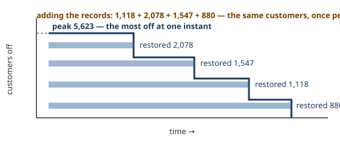

# 4a. One fault, five records
*~7 min read · the PR #1 branch and its follow-up commits · 17–18 August 2026*

*Where we are:* sixteen days of raw logs, a database that rebuilds from them, and settled
semantics for when an outage starts and ends (chapter 3). Before anything can be counted,
one more question: what is *one outage*?

## The question that opened this stretch

The water site never had to ask. Its feed stamps every notice with a reference number, and
pins sharing the number are one event — when one incident was published as eighteen pins over
eighteen nights, the grouping key came free in the data. ESB's feed has no such key. Worse,
it manufactures the opposite problem: **ESB opens a new outage record each time a fault's
scope changes**, so a single physical fault arrives as a family of ids — and nothing in any
record says "we are five views of the same thing".

On the page, that read as five separate outages. In the arithmetic, it counted the same
customers once per record. Both had to stop before the site could publish a single number.

## What changed

### Worked example: Bealistown, 14 August

Bealistown's one fault that day was five records: a `Fault` at 2,427 customers, then four
`Restored` records at 1,118, 2,078, 1,547 and 880 as sections of the network came back. What
they share — exactly — is a location and a start time.

Add up the records and you get nonsense with a straight face: the four restoration records
alone sum to 1,118 + 2,078 + 1,547 + 880 = 5,623 "affected customers", for an event whose
real peak was 5,623 — an agreement that is pure coincidence, because one of the records
already carried the whole figure at its widest. Summing counts the same customers once per
section they were restored in. The honest reading is the one a person would give watching the
lights: *at most* 5,623 customers were off at any single moment, and the number fell as each
section came back (`notes/grading.md`, 17 Aug 2026).

> **Concept: an envelope, not a sum.** When one event is reported as several overlapping
> records, its customer count at each instant is the *most customers any view reported off at
> that moment* — picture the curves of the individual records laid over each other, and trace
> the top edge. That top edge is the envelope. It decays stepwise as sections restore, it
> never counts a customer twice, and two useful numbers fall out of it: the **peak** (the
> highest point — "how big was this at its worst") and the **customer-minutes** (the area
> under the edge — "how much outage was there altogether"). The site integrates
> customer-minutes over that decaying count rather than multiplying one count by one
> duration, precisely because crews restore in sections: 5,623 × the full duration would
> charge the fault as if nobody got their power back until everybody did.



So: records are merged into an **event** when they share an identical location and start
time. On the first month's corpus that folded 1,457 ids into 1,333 events, and the effect on
the national figures was not subtle — the interruption count (CI) fell from 1.60× ESB's own
published figure to 1.35×, and Customer Minutes Lost from 195 to 172 (`notes/grading.md`,
17 Aug 2026). A looser rule — requiring the coordinates to be merely *close* rather than the
location identical — was tried and merged two extra pairs in the whole month, so the simple
rule stands. A merged event's timeline reports customers still off rather than one line per
restored section, which is how Bealistown became one story on the page instead of five.

### The faults that must not be merged

Then the corpus offered a trap wearing the merge's own clothes. Chapter 3 mentioned the 85
events first seen already restored; classifying their neighbours turned up a pattern of
same-place, minutes-apart faults that *look* like split records and are not:

```
Tycor (Waterford), 11 Aug   09:31–10:28 (369c) → 10:29–10:39 (253c)
                            → 10:40–10:49 (295c) → 10:50–11:03 (369c)
Boghall Road (Wicklow)      02:17–04:01 (150c) → 04:02–04:12 (150c) → 04:13–04:26 (150c)
Creagh (Galway)             03:46–04:27 (1027c) → 04:28–… (1027c)
```

Tycor failed four times in ninety minutes. Each leg starts nought to one minute after the
previous restoration, at identical coordinates, often with an identical customer count —
fifteen such chains cover 32 events, and five of the fifteen hit the same count on every leg
(`notes/grading.md`, 17 Aug 2026). These are not one fault recorded four ways. They are the
same customers losing supply four separate times — a breaker re-tripping, a fix not holding —
and ESB's own interruption index counts each one. Merging them would quietly understate how
often supply actually failed, which is half of what the site exists to measure.

> **Concept: a chain is not a split.** Two patterns produce a family of same-location records
> minutes apart. A *split* is one interruption reported as several overlapping views —
> Bealistown — and must be merged or customers are counted repeatedly. A *chain* is several
> interruptions in quick succession — Tycor — and must **not** be merged or interruptions are
> counted short. No start-time tolerance can tell them apart, because both live in the same
> few minutes; the only separator is **overlap**. Split records run concurrently (the
> sections were all off together); chain legs are strictly sequential (power was back, then
> failed again). So the merge key stays exact — identical location *and* start time — and
> sequential neighbours stay separate rows, tagged so a reader sees the story: "outage 3 of 4
> at this location in quick succession". A chain tag needs the next fault to start within 15
> minutes of the last restoration and within 1 km, so two faults at opposite ends of a large
> town are not chained. 36 events carry the tag.

The relaxation was measured before it was rejected, because "surely a small tolerance is
safe" deserved numbers. Merging same-location records that overlap *and* start within a
tolerance: at 5 minutes, 1,281 events and CI at 1.33×; at 15 minutes, 1,239 and 1.32×; at 60
minutes, 1,164 and 1.30× (`notes/grading.md`). Three points of a documented, understood bias
— chapter 4b explains where the residual 1.35× comes from — in exchange for folding together
up to 169 events that may be genuinely distinct interruptions. Rejected: the exact rule
already captures the split pattern it was built for, and the rest is not worth the false
merges.

One deliberate quirk completes the rule. Nine events share a location name and start time
but sit 1–10 km apart in *different counties* — one fault whose sections straddle a boundary,
like "Little Bray" appearing in both Wicklow and Dublin. County is part of the merge key, so
they stay separate: each county's page must carry the customers actually in that county, and
merging would hand one county's outage to its neighbour. The accepted cost is that a handful
of physical incidents are counted once per county at national level.

### The same shape, upside down

Set the two sites side by side and the symmetry is exact enough to be worth stating. The
water site's feed *gives* identity (a reference number) and its work was to reassemble one
event's many pins without double-counting the people near them; its hard case was a notice
republished nightly for eighteen nights, which its series called an event in a trench coat.
This feed *withholds* identity, so the work was to infer it — and the hard case is the
opposite one: records that look identical and must be kept apart. Both repositories converged
on the same governing sentence — one physical thing is one row — and reached it by opposite
operations: uisce merges what its feed splits by publication habit; esb merges what its feed
splits by bookkeeping, and refuses to merge what mere proximity suggests. In both cases the
deciding evidence was overlap in time, and in both cases the rejected shortcut (a distance or
time tolerance) was measured and written down rather than argued away.

## Where it left the site

1,333 events, each one physical fault or planned work; envelopes instead of sums;
customer-minutes integrated over a decaying count; chains tagged as the repeat offenders they
are; and a residual, *explained* gap to ESB's own indices — the interruption count still runs
about a third high, and the next chapter is about why that number cannot be fixed, and what
to grade on instead.

## Notes

- `notes/grading.md` "Settled, with the numbers" (17 Aug 2026): Bealistown's five records
  (2,427; 1,118 + 2,078 + 1,547 + 880 = 5,623; peak 5,623); merge on identical location and
  start time, 1,457 → 1,333; CI 1.60× → 1.35×, CML 195 → 172; the coordinates-close variant
  (2 extra pairs); envelope reporting; integration over the count.
- `notes/grading.md` "Repeat faults are not splits" and "The merge rule was not relaxed"
  (17 Aug 2026): Tycor / Boghall Road / Creagh; 15 chains, 32 events, 5 identical-count
  chains; the tolerance table (1,333 / 1,281 / 1,239 / 1,164; 1.35× / 1.33× / 1.32× / 1.30×);
  "Splits across a county boundary are deliberate" (9 events; Little Bray).
- Commit "Tag repeat faults on the page, and measure the poll interval" (18 Aug 2026): the
  chain tag wording, the 15-minute / 1 km rule, 36 tagged events.
- Commit "Grade on ESB's own 4-hour standard, and fold split outages into one event"
  (17 Aug 2026): the merge landing; its CI figures (1.60× → 1.32×) are that day's corpus —
  the note's re-measurement is quoted above.
- The water site's mirror image: its series, chapter 9a (pins sharing `reference_num`; the
  eighteen-night event).
