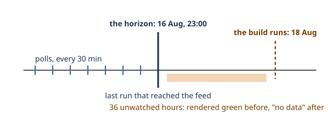

# 5. What the page may claim
*~9 min read · PR #1 · 18 August 2026*

*Where we are:* the numbers are settled — events, ends, grades. This chapter is the page
itself: what it shows, what it costs to load, and the day it stopped mistaking an absent
collector for a calm network.

## The question that opened this stretch

A status page makes claims continuously — every green cell is a claim, every timestamp, every
county row. PR #1, the pull request that created the site, spent as much of its effort on
*bounding* those claims as on rendering them. Three questions run through it: what may a page
claim about a day nobody measured? about an outage that has not ended? about a month it only
partly saw? The water site faced every one of these in its own vocabulary. The answers here
rhyme with its answers — and where they differ, the collector in the hall is the reason.

## What changed

### The shape of the site: one file, a budget, and shards

Like the water site, this one is static pages with the CSS and JavaScript inlined — a reader
arriving from a search result costs one request — built by the standard library from the
database chapter 1's logs rebuild. The part that had to be got right on day one was the
payload split, because the archive only grows. The initial load is `index.html` plus a
`data.js` carrying one row per county per month, with each month's day bars packed into a
31-character string; the individual outages live in per-county shard files that are not
fetched until a reader opens that county; and the place-name search index loads on the first
keystroke. That held the first build at 34 KB — later 41 KB — against a **500 KB budget
enforced by a test** and printed by every build, and it keeps the initial load flat as the
archive grows (commit "Add a static status site…", 18 Aug 2026; PR #1). The budget is a
publishing rule, not an optimisation: individual outages never ride in `data.js`, or the page
would grow with the archive and the budget would only fail once it mattered.

### Day cells: magnitude, not presence

The overview's heart is a bar of day cells per county. The obvious rendering — colour a day
that had an outage — was dead on arrival in this data: **66% of county-days carried at least
one fault**, so a presence-coloured bar is a near-solid wall of red saying nothing. Cells are
coloured by magnitude instead — fault minutes-lost per customer in that county that day —
with absolute bucket thresholds, fixed so that a published day never changes colour later
(`notes/grading.md`, "Day cells", 17 Aug 2026):

| Bucket | min/customer/day | Share of the first month |
|---|---:|---:|
| Normal | < 0.05 | 44% |
| Minor | < 0.3 | 22% |
| Moderate | < 1.0 | 19% |
| Major | < 3.0 | 9% |
| Severe | ≥ 3.0 | 6% |

The division of labour is stated in the note and worth repeating: the bar answers *how much*
disruption a day carried; the grade answers *how fast supply came back*. Two questions, two
instruments. The water site arrived at the same discipline from the opposite direction — its
bars once encoded severity by opacity and answered too many questions at once; by its chapter
16 the rule there was "the bars answer one question" too.

Under the bars, each outage renders the updates ESB issued for it — and how many to show was
decided by counting rather than taste. Counting only reader-visible fields (excluding the
status message, whose unstable whitespace made it the most-changed field while carrying no
news, and the coordinates, which move as crews narrow a fault down): 58.4% of events have one
distinct state, 90.4% at most two, 97.3% at most three. So updates render inline up to three,
and fold behind a disclosure at four or more — which fires on 2.7% of events. One subtlety
kept the numbers honest: a poll cycle records its list change and its detail change seconds
apart, so without coalescing, a plain `Fault → Restored` transition read as *two* updates and
inflated a third of all outages into the disclosure. Changes within 15 minutes are one
update; polls are 30 minutes apart, so nothing real merges (`notes/grading.md`, "The update
disclosure").

### The clock and the horizon

The deepest fix in PR #1 was about time, and it is this site's version of a lesson the water
site's series states as a concept box: the data's clock and the build's clock are different
clocks. `now` was doing two jobs in the code — deciding which days are in the future, and
standing in for how far the collected data reaches. Those two diverge the moment the
collector stops, and everything then fails in the same flattering direction: an absent
collector reads as a calm network.

> **Concept: the collection horizon.** The horizon is the last moment a run actually reached
> the feed — taken from the run log, counting only runs that got a list response (a run that
> died on authentication observed nothing). Every measured window on the site ends at the
> horizon: day cells, monthly totals, rate denominators, grade windows. `now` survives in
> exactly one job, deciding which days are still in the future. The water site needed the
> same separation for a different mechanic — its builds *download* data at build time, so its
> gap was between two scheduled builds; here the collector and the site builder are separate
> machines (chapter 6b), so the gap can be a dead Pi, a dead push, or a build racing a push.
> Same invariant either way: **a page may claim only what was observed, and the edge of
> observation is a fact in the data, not the time on the wall.**

Two things were wrong, both found by checking the site against a corpus that happened to be
36 hours behind (commit "Fix the placement grid, and measure against the data rather than the
clock", 18 Aug 2026):

- **Days past the horizon were coloured.** A day nobody polled rendered green — "no
  significant fault" — beside a build timestamp that looked fresh. On that corpus, 17 and 18
  August were published as quiet for all 26 counties, against a last observation of 16 August
  at 23:00. Those days are now a distinct *no data* state, and the page prints the horizon,
  flagged when it falls more than a day behind the build.
- **CML was divided by wall-clock time.** Annualising over a window that included the gap
  understated the rate: 161.7 against a corrected 176.1 CML per year — a 9% understatement
  manufactured by 36 hours of absence. The denominator is now observed time.

### An outage still running is not a fast restoration

The subtlest of the family. The charter share was always *meant* to skip outages still
running — there is no restoration to judge yet — and the test that was supposed to do it,
"does the outage end inside the window?", could not: an unfinished outage's end is the
horizon, and so is the window's, so the test always passed, and a fault half an hour old
was scored as "restored inside four hours".

The size of that flattery was measured by replay: rebuilding the page as of 05:40 — the
Pages build time — on each of the first sixteen August days, **fifteen of the sixteen had at
least one fault open** (twenty-five on the 4th). The grade was being flattered on essentially
every build (`notes/grading.md`, "An outage still listed…"). Ongoing-ness is now carried
explicitly: still listed within a poll cycle of the horizon, with no restore time, and such
outages are excluded from the charter share until they end. The tempting stricter rule —
exclude every outage without a *confirmed* restore time — was rejected because it contradicts
chapter 3's settled decision: outages that quietly leave the feed end on ESB's estimate, and
that is the ordinary way a fault ends here. The question is whether the outage was over, not
whether ESB said so. One deliberate exception cuts the other way: an ongoing outage past 24
hours *does* count against the charter's compensation threshold, because the time it has
already run is a lower bound — "this has been out more than a day" is true whatever happens
next.

Two smaller definitions were pinned in the same pass, each *before* it could change a
published number. The **peak** customer count is clipped to the outage's own window before
empty segments are dropped, so a count revised upward after ESB called the outage restored
cannot become the peak — seventeen events carried such a late segment, none of them was the
maximum, so this moved nothing and now never will (`notes/grading.md`, "The peak is the
highest count…"). And **part-observed days keep their colour and say so**: the first day of
collection is under three hours of watching and renders green; grey-out was rejected (the
trailing short day is the most recent day, the one a reader most wants), pro-rating was
rejected (it invents precision a 30-minute poll does not have, and would turn one fault in a
two-hour window into a catastrophe), so the cell shows what was actually seen and the tooltip
says "only part of this day was recorded".

### Worked example: Monaghan's fifteenth fault

One more PR #1 bug shows the class of error a sharded site invites. The per-county shards
filed each outage under its *start* month; the county-month tiles counted outages by
*overlap* with the month. An outage crossing midnight on the 31st therefore appeared in one
month's count and the other month's list: Monaghan's August page claimed 15 faults above a
list of 14. The shards now file by overlap, like the counts — and when chapter 6b's county
archive later flattened those shards into one list, the same double-filing had to be undone
in reverse, so the definition earned its keep twice (commit "Fix the placement grid…",
18 Aug 2026; PR #19, 26 Aug 2026).

## Where it left the site

Live, at `baz8080.github.io/esb`: a 41 KB initial load against a 500 KB enforced budget, day
bars that answer one question, updates folded by a measured threshold, and a page whose every
window ends at the horizon — with `no data` where nobody watched, ongoing faults unjudged,
and short days labelled. From here on, nothing in this repository changes what the numbers
*mean*. The remaining chapters are about the frame: sharing a design system with two sibling
sites, and learning to speak to a reader.

## Notes

- Commit "Add a static status site for the collected outage data" (18 Aug 2026): payload
  split, 34 KB; PR #1 (18 Aug 2026): 41 KB, budget test; day cells and disclosure rationale.
- `notes/grading.md` "Day cells" (17 Aug 2026): 66% of county-days, bucket table. "The
  update disclosure": states table (58.4 / 90.4 / 97.3%, 36 events at 4+ = 2.7%), 15-minute
  coalescing.
- `notes/grading.md` "What the clock knows and what the data knows" (18 Aug 2026): the
  horizon definition; 17–18 Aug rendered quiet vs horizon 16 Aug 23:00; CML 161.7 vs 176.1.
- `notes/grading.md` "An outage still listed is not a fast restoration": the `o.end <= hi`
  failure; replay at 05:40, 15 of 16 days, 25 on the 4th; the rejected stricter rule; the
  24-hour lower-bound exception. "The peak is the highest count while the outage was live"
  (17 inverted segments, none a max); "Short days say so".
- Commit "Fix the placement grid, and measure against the data rather than the clock"
  (18 Aug 2026): Monaghan 15-over-14; the horizon plumbing (`observed_until`).
- The water site's version of the clock lesson: its series, chapter 15 ("data clock vs build
  clock") and chapter 6 (windows ending at what was observed).
